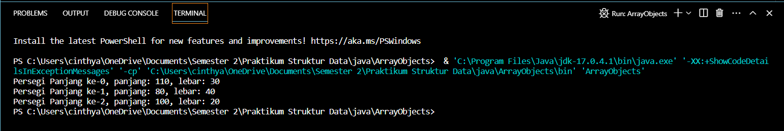
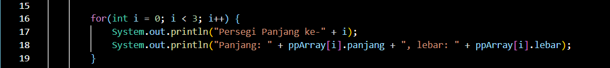
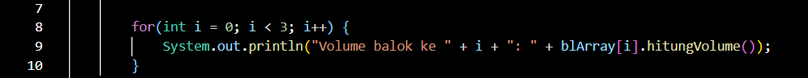

# Laporan Praktikum 3
NIM : 2241720051

Nama : Cinthya Achwatul Ifnu

Kelas : TI 1D

## 3.2 Membuat Array dari Object, Mengisi dan Menampilkan

### 3.2.1 Langkah-langkah Percobaan

### 3.2.2 Verifikasi Hasil Percobaan

### 3.2.3 Pertanyaan: 
1.	Pada sebuah class yang akan dibuat array tidak harus selalu memiliki method namun sebuah class yang akan dibuat array harus memiliki atribut untuk menyimpan nilai.
2.	Tidak, baris program tersebut bukanlah sebuah konstruktor karena tidak mempunyai parameter. Dan baris program tersebut merupakan instansiasi dari objek “ppArray”.
3.	Kode tersebut merupakan deklarasi objek array dimana pada kode ini terdapat Panjang elemen array sebanyak 3 nilai atau elemen 0, 1, 2. Namun kode ini masih belum ada isinya, kosong atau bernilai null.
4.	Kode tersebut digunakan untuk mengisikan sebuah PersegiPanjang pada aray. Didalam kode tersebut terdapat instansiasi objek array, memberi nilai pada atribut panjang dan lebar, memberi nilai array pada elemen.
5.	Karena pada array of objek sebuah class digunakan untuk membuat objek, sehingga pada class PersegiPanjang hanya digunakan untuk mendklarasikan objek yang nantinya akan diproses oleh method atau fungsi yang terdapat pada sebuah main. Pada main ArrayObjects terdapat beberapa fungsi atau method yang mengakses objek dari suatu class, sehingga program yang kita inginkan dapat dijalankan.

## 3.3 Menerima input isi array menggunkan looping

### 3.3.1 Langkah-langkah Percobaan

### 3.3.2 Verifikasi Hasil Percobaan

### 3.3.3 Pertanyaan
1. Bisa
2. 
   
3. Pada kode tersebut penyebab error bukan dari tipe data integer, tipe data integer sudah sesuai dengan atribut sisi yang bernilai “20”. namun penyebab error adalah karena tidak terdapat instansiasi array of object.
4. 
   
5.	Boleh, hanya jika ppArray[i] diinstasiasi menggunakan perulangan dan indeks yang berbeda.

## 3.4 Operasi Matematika Atribut Object Array

### 3.4.1 Langkah-langkah Percobaan

### 3.4.2 Verifikasi Hasil Percobaan

### 3.4.3 Pertanyaan
1. Iya, bisa
   
2. (no 2 hingga 5)
   

   

   
   

## 3.5 Latihan Praktikum
1. 

   

   

   

   

2. 

   
   
   
   